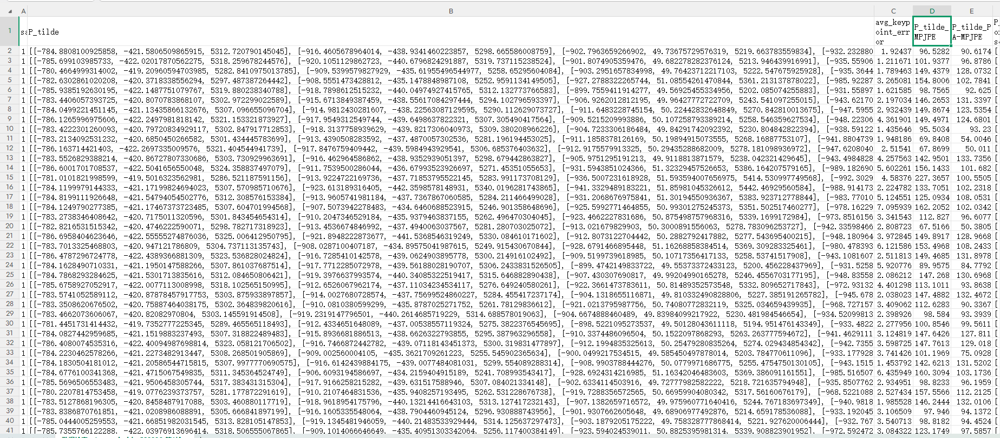
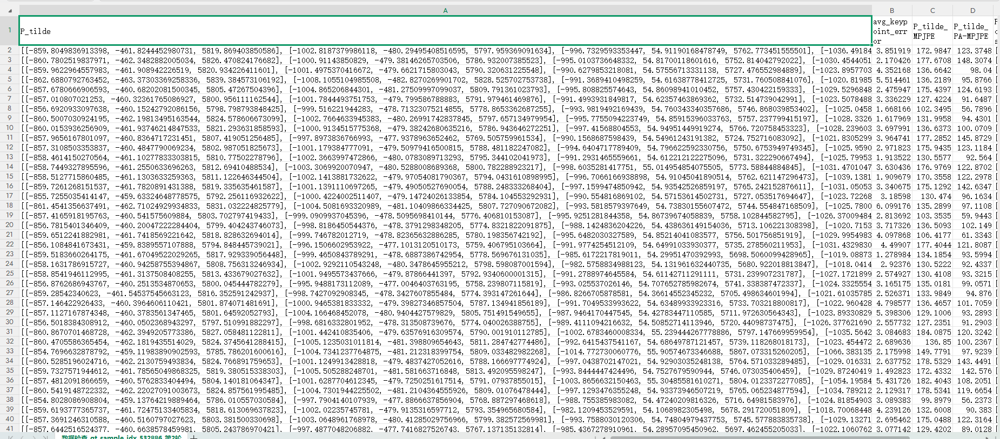
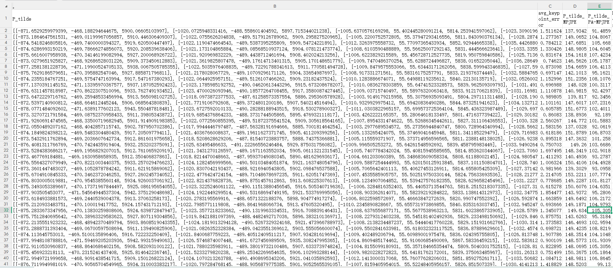
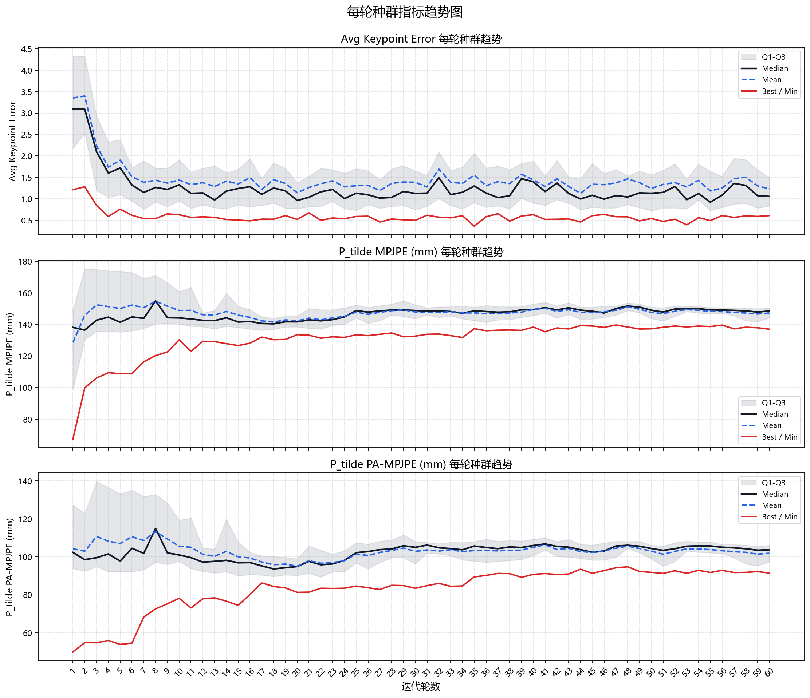
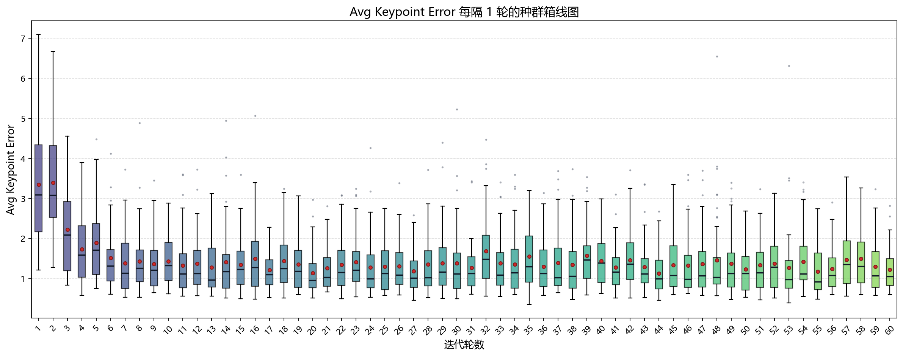
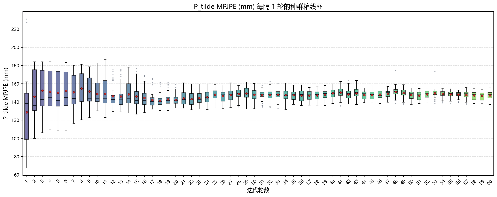
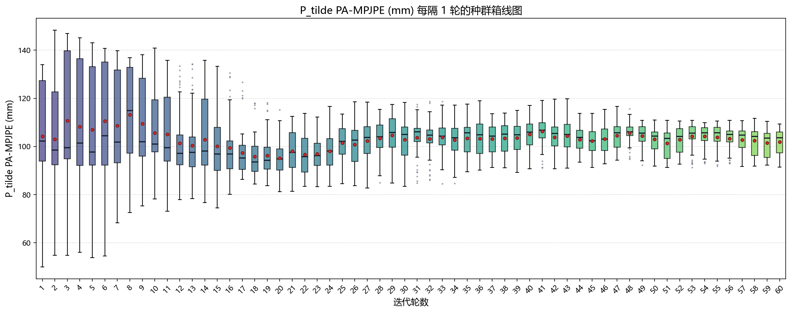
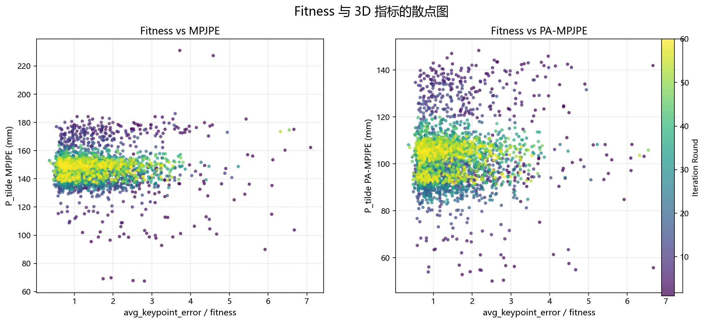

# 数据分析

这三张图分别是第1轮、第2轮、第60轮收集的数据。P_tilde：PSO 之后再做“射线投影”得到的 3D 姿态，也就是更靠近相机成像几何约束的最终姿态。它会被拿来算 MPJPE 和 PA-MPJPE。avg_keypoint_error:这轮姿态的适应度值，也就是fitness，也就是2D关键点的平均L2重投影误差。P_tilde_MPJPE:和真实3D姿态比较得到的评估指标值 ，P_tilde_PA-MPJPE:在P_tilde_MPJPE基础上，先做Procrustes对齐，再和真实3D姿态比较得到的评估指标值。数据分析主要是看P_tilde，avg_keypoint_error，P_tilde_MPJPE，P_tilde_PA-MPJPE的变化情况。
## 1. 种群迭代趋势分析
### 1.1 每轮种群指标趋势图
本组图表展示算法迭代过程中，种群核心指标随轮次的变化趋势，共包含3张子图，所有子图的横坐标均为**迭代轮数**，覆盖第1轮到第60轮，每轮统计种群内50个个体的对应指标。

#### 图例说明
- **灰色阴影（Q1-Q3）**：代表每轮50个个体中，中间50%个体的指标范围。其中Q1为第25百分位数，Q3为第75百分位数，灰色区域即Q1到Q3的区间，反映该轮种群的主要分布范围。
  - 灰色区域越宽，说明本轮种群个体差异越大，优劣个体差距明显，种群较为分散；
  - 灰色区域逐渐收窄，说明50个个体的表现趋于集中，种群正在收敛。

- **黑色实线（Median，中位数）**：每轮50个个体按指标从小到大排序后，位于中间位置的数值，代表本轮种群的「典型水平」。
  - 黑色线持续下降，说明种群内普通个体的质量在普遍提升，并非仅单个最优个体偶然变好，种群整体的典型质量稳定改善。

- **蓝色虚线（Mean，平均值）**：每轮50个个体的指标平均值，代表种群的整体平均水平。
  - 蓝色线下降说明种群整体平均表现变好，但平均值易受异常值影响：少数极差的个体会拉高均值，少数极好的个体会拉低均值。

- **红色实线（Best/Min，最小值）**：每轮50个个体中的指标最小值，即本轮的最优个体表现。

#### 趋势组合解读
- Mean 和 Median 同步下降：说明种群整体质量的改善是可靠、普遍的；
- Mean 下降但 Median 无明显变化：可能仅由少数优质个体拉低了均值，多数个体未明显改善；
- Median 下降但 Mean 无明显变化：说明大多数个体表现变好，但仍存在少量表现极差的异常个体。

#### 图表作用
本组图用于证明迭代过程中是**种群整体分布在向更优方向移动**，而非仅单个个体变好；可直观观察中位数是否持续下降、异常值是否逐步减少、算法在迭代后期是否进入收敛状态。

---

## 2. 种群分布箱线图分析
本组图表以箱线图形式，展示每轮迭代轮次的种群指标分布，更清晰地呈现每轮个体的离散程度、分位位置和异常点分布。

所有箱线图的横坐标为**迭代轮数**，纵坐标为对应指标的数值，箱线的上下沿分别对应Q3和Q1，箱体中线为中位数，须线延伸至合理范围内的最大值和最小值，超出范围的点为异常值。

通过箱线图可以横向对比不同轮次的种群分布变化，观察箱体是否逐步收窄、中位数是否持续下移、上下异常值的数量和幅度是否随迭代减少。

---

## 3. Fitness与3D指标相关性分析
本组为散点图，用于探究算法优化目标（Fitness）与最终3D姿态质量指标之间的相关性。
本算法优化的直接目标是 `avg_keypoint_error`（即Fitness），但最终核心关注指标是3D姿态误差：**MPJPE** 和 **PA-MPJPE**。

#### 图表说明
- 横坐标 `x`：单个个体的 `avg_keypoint_error`（2D重投影误差，即Fitness）
- 纵坐标 `y`：单个个体的3D姿态误差（MPJPE / PA-MPJPE）
- 点的颜色：该个体所属的迭代轮次
  如果横坐标（2D误差）很小的点，纵坐标（3D误差）也很小或者横坐标（2D误差）很大的点，纵坐标（3D误差）也很大 则表示有相关关系。否则不存在严格的相关关系

#### 分析结论
从散点分布可以观察到：大量横坐标（2D误差）很小的点，纵坐标（3D误差）反而很高；而部分横坐标较大的点，纵坐标却处于较低水平。
这说明 `avg_keypoint_error` 与 `P_tilde_MPJPE` / `P_tilde_PA-MPJPE` 之间**不存在严格的单调正相关关系**，同一个2D投影结果可以对应多个差异较大的3D姿态。

该现象本质是**单目2D约束下的深度歧义问题**：低2D重投影误差并不必然对应最低的3D姿态误差，仅靠2D投影约束无法完全消除深度维度的不确定性。验证了单视角2D约束存在天然的深度歧义局限。
