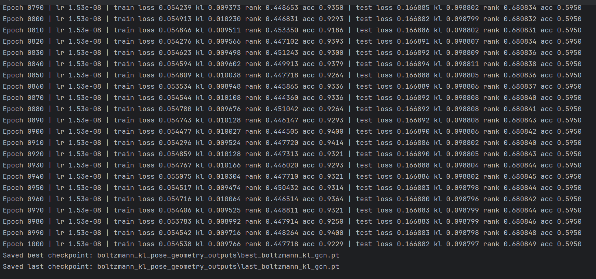

# 组会 7.10

通过局部扰动敏感性分析找到重投影误差和姿态的对应关系。  
2D 重投影误差并不是对所有 3D 姿态变化都同样敏感。它对全局位置变化非常敏感，尤其是：

- 全局深度
- root 平移
- 整体位置变化
- 躯干朝向

## 整体流程

原始候选姿态数据  
↓  
通过 PSO 放到相机坐标系  
↓  
计算全局几何特征、投影残差、重投影误差  
↓  
生成 `bayesflow_posterior_mutation_train_geometry.csv`  
↓  
训练几何感知代理模型

---

## 特征描述

为每个候选姿态计算以下特征：

- **root_x, root_y, root_z**  
  表示人体根节点（即骨盆关节 root/pelvis）的三维坐标。

- **mean_x, mean_y, mean_z**  
  17 个关节坐标的 x, y, z 平均值，可以理解为整个人体骨架的平均中心位置。

- **min_z, max_z, std_z**  
  - 最靠近相机的关节深度  
  - 最远离相机的关节深度  
  - 所有关节深度的标准差  
  这三个值描述人体在深度方向上的分布，帮助模型理解人体在前后方向上的展开情况。

- **body_center_x, body_center_y, body_center_z**  
  人体 3D 姿态在相机坐标系下的整体中心位置。

- **body_scale**  
  该 3D 姿态的整体骨架尺度。

- **reprojection_error**  
  重投影误差。

---

## 训练集总览

具体来说，训练集包含以下输入数据：

| 数据类别             | 说明                                                       |
| -------------------- | ---------------------------------------------------------- |
| **pose_2d**          | 原始 2D 姿态。                                             |
| **candidate_pose_norm** | 候选 3D 姿态（归一化坐标）。                               |
| **geometry_features**   | root、mean、z 分布、body_scale 等 13 个几何特征。          |
| **camera_features**     | 由 `camera_K` 提取出的 `fx, fy, cx, cy`。                 |
| **标签（fitness）**     | 用于监督学习的适应度值。                                   |

> **注意**：如果训练集使用了上述这些数据，测试时的输入也应包含相同的 root、mean、z 分布、body_scale 等 13 个几何特征，才能获得 3D 姿态对应的分数。

---

## 运行结果

